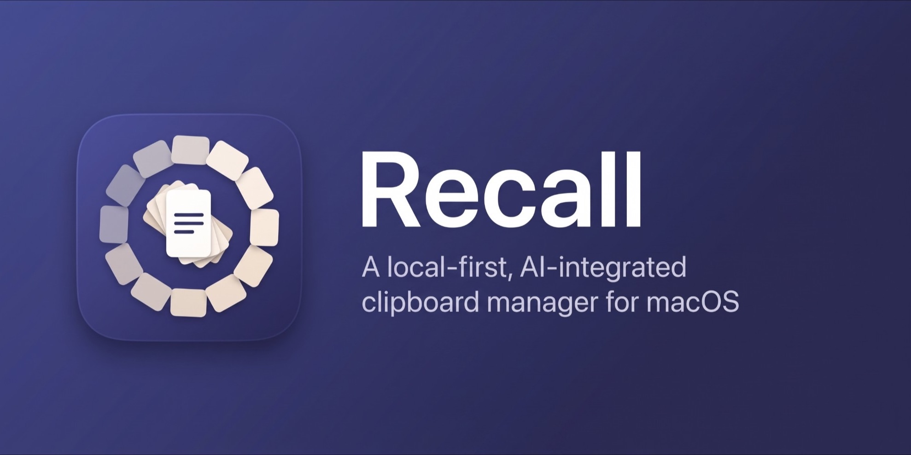
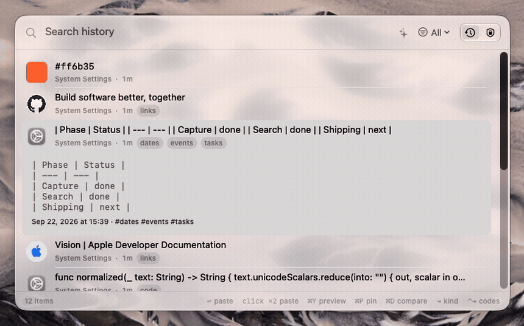

[English](README.md) · [فارسی](README.fa.md) · [Русский](README.ru.md) · **简体中文**

> 本文是[英文 README](README.md) 的译文。如两者有出入，以英文版为准。

Recall 会记住你拷贝的一切，让你按*含义*而不是按原文字词来搜索，并把任何看起来像凭据的内容当作放射性物质来对待。



搜索 **rounding** 能找到 `border-radius` 这段代码——尽管这个词在其中根本没有出现。没有同义词表，也没有云服务：只有一个在设备上运行的嵌入模型，和一个在你的 Mac 上运行的查询扩展器。

---

## 目录

- [为什么还要一个剪贴板管理器](#为什么还要一个剪贴板管理器)
- [名副其实的搜索](#名副其实的搜索)
- [粘贴为…](#粘贴为)
- [像对待放射性物质一样对待机密](#像对待放射性物质一样对待机密)
- [双重认证代码](#双重认证代码)
- [文本片段与短代码](#文本片段与短代码)
- [从图片中提取文本](#从图片中提取文本)
- [其他功能](#其他功能)
- [键盘](#键盘)
- [永远不会离开你 Mac 的内容](#永远不会离开你-mac-的内容)
- [安装](#安装)
- [状态](#状态)
- [许可证](#许可证)

---

## 为什么还要一个剪贴板管理器

因为剪贴板管理器中真正有意思的问题，不是存储，也不是一个列表。而是：

- **你记得一样东西*是什么*，而不是它*写了什么*。** 所以搜索必须基于含义。
- **剪贴板管理器是机器上位置最优越的凭据窃贼。** 所以它必须按照“自己就是窃贼”的假设来构建，然后拒绝这样做。
- **模型应该在数据所在的地方运行。** 为了一句话的摘要把剪贴板发送给某个 API，是一笔奇怪的交易。

下面的一切都源自这三点。

---

## 名副其实的搜索

输入你依稀记得的内容。Recall 会先用粗略过滤缩小范围，让暴力比对在历史记录增长后依然可行，然后将你查询的设备端嵌入与每一个剪贴项逐一打分。

上面的演示之所以能成功，靠的是查询扩展：单靠句子嵌入，*“rounding”* 会让这条 CSS 规则排在无关代码之后。设备端语言模型会先扩展查询。这是经过测量的，而不是假设的——项目有一个排序评估工具，使用真实用户会输入的查询，计算 recall@3，并且在它写好的当天就抓到了一次真实的性能倒退。

运算符可以与上述一切组合使用：

| 运算符 | 查找 |
| --- | --- |
| `kind:image` | 仅图像——也可用 `text`、`link`、`color`、`file` |
| `app:Xcode` | 从特定 App 拷贝的剪贴项 |
| `since:yesterday` | 比这更新的所有内容 |
| `is:pinned` | 你已固定的剪贴项 |

**智能集合**是存储下来的问题。自动标签为它们提供内容，你也可以编写自己的规则。清除历史记录不会删除集合——问题比答案活得更久。没有任何条件的集合会被拒绝，而不是悄悄匹配所有内容。

---

## 粘贴为…

在任意剪贴项上按 **⌥⏎**，让它在粘贴前先经过设备端模型处理：Markdown 表格、翻译、摘要、JSON、Python。

输出会逐步显示在预览中，在你确认之前不会粘贴任何内容。转换只是对意图的*猜测*，而把猜测直接粘贴进别人的文档，就是失去对方信任的方式。

被标记为机密的剪贴项没有转换、没有展开，也没有 AI 菜单。

---

## 像对待放射性物质一样对待机密

剪贴板管理器能看到你拷贝的每一个密码。Recall 的设计前提是：这是一种隐患，而不是一项功能。

### 在拷贝时识别

**29 条规则**在拷贝时运行，早于任何写入。每条规则都对应一种公开的固定格式，因此误报率接近于零：

| | |
| --- | --- |
| **云与基础设施** | AWS 访问密钥、AWS 私密密钥、Google API 密钥、Cloudflare 令牌、Kubernetes 配置 |
| **开发者平台** | GitHub 令牌、GitLab 令牌、npm 令牌、Hugging Face 令牌 |
| **支付与通信** | Stripe 密钥、Twilio 标识符、SendGrid 密钥、Slack 令牌、Discord 机器人令牌、Telegram 机器人令牌 |
| **AI 提供商** | Anthropic API 密钥、通用 `sk-` / `pk-` API 密钥 |
| **密钥与令牌** | 私钥块、JSON Web 令牌 |
| **个人信息** | 卡号、IBAN、国民身份号码、恢复短语、App 专用密码 |
| **文本模式** | 带密码的 URL、数据库连接字符串、环境变量文件、密码赋值、一次性代码 |

匹配的剪贴项会被标记为 `secret`。它**只保存在内存中，永远不会写入磁盘**，在列表中被隐藏，被排除在 AI 功能之外，并在 **60 秒后被删除**（可配置）。

Recall 还会告诉你是*哪一条*规则触发了。无法核实的警告，就是你会学着忽略的警告。每条规则都可以单独关闭。

### 根本不会被记录

来自 **28 款密码管理器和验证器**的内容——1Password、Bitwarden、KeePassXC、Dashlane、Enpass、LastPass、NordPass、Proton Pass、Strongbox、Secretive、Apple 的“钥匙串访问”和“密码”、Authy 等——会在读取之前就被丢弃；写入它们的 App 标记为“隐藏”的剪贴板项同样如此。你也可以添加自己的排除项。

### 仅内存模式

让整个 App 在内存中运行。没有数据库文件，没有数据目录，没有加密密钥。退出即清除一切。

### 存储在磁盘上

其他情况下，数据存放在加密的 SQLite 数据库中：内容以 AES-GCM 密封，查找使用盲索引，采用 WAL 日志，目录权限为 `0700`。

---

## 双重认证代码

Recall 可以生成 TOTP 和 HOTP 代码——也就是验证器 App 给你的那六位数字。按下 **⌘⇧A**。

在剪贴板管理器里，这是最有理由*不*存在的功能，所以它的构建标准与 App 的其他部分不同。

### 密钥不在 App 里

双重认证密钥不是密码。它可以永远生成有效代码，而且自己永远不会更换。所以 Recall 不持有它。

密钥保存在**一个独立的、沙盒化的 XPC 辅助进程**中，它有自己的代码签名、自己的容器，以及自己的——范围窄得多的——权限。主 App 无法沙盒化（读取剪贴板的来源 App 和模拟 ⌘V 都需要沙盒不允许的能力），但**辅助程序是沙盒化的**，并且放弃了一切不需要的能力：没有网络、没有文件访问、没有辅助功能、没有剪贴板、没有摄像头。

两者之间的协议中没有任何返回密钥的调用。不是受保护的调用，也不是需要认证的调用——根本就没有这样的方法，因为 App 没有理由持有密钥。它请求的是*代码*，收到的也是*代码*。

密钥在辅助程序的容器内以 AES-GCM 密封，权限为 `0600`，保存在一个以原子方式重写的文档中，因此不可能出现写了一半的数据。

> **为什么不用钥匙串？** 钥匙串是显而易见的选择，但没有付费签名身份就无法使用。数据保护钥匙串按 entitlement 决定访问权限，这需要真实的团队标识符，而 ad-hoc 构建没有——它会返回 `errSecMissingEntitlement`。文件钥匙串通过绑定到调用方代码签名的 ACL 决定访问权限，而签名每次构建都会变化，所以它会试图*询问用户*——但 XPC 服务没有可以用来询问的界面，于是以 `errSecInteractionNotAllowed` 失败。密封容器比数据保护钥匙串条目弱，但比明文强得多，是没有 Developer ID 时能做到的最好方案。参见 [ADR 0005](docs/adr/0005-two-factor-helper.md)。

### 默认使用 Touch ID

认证**默认是必需的**，因为一个 App 能自行关闭的安全默认值不算默认值。共有三种策略：

- **始终**——每个代码，每一次。
- **一段时间后**——1、5、15、30 或 60 分钟。计时只保存在内存中，因此退出 Recall 或重启辅助程序后，下一个代码会从锁定状态开始。一个能在重启后存续的宽限期，是没有人选择过的宽限期。
- **永不**——任何坐在键盘前的人都能读取所有代码。

该选择保存在辅助程序中，而不是 Recall 的设置里。

### 添加账户

- **扫描屏幕上的二维码。** 框选显示注册二维码的区域，Recall 就会读取它。无需手机——这是最快的方式。
- **拷贝一个 `otpauth://` 链接**，Recall 会提示你导入它，而不是把一个能永远生成代码的剪贴项存进历史记录。从 Google 身份验证器导出的 `otpauth-migration://` 链接同样可用，包括一次导入多个账户。
- **手动输入密钥**，适用于只显示 base32 的网站。

### 使用代码

代码会连同剩余秒数一起显示。你可以拷贝它，或者直接粘贴到你之前所在的 App 中。代码只在有效期内保留，面板关闭时即从内存中清除。

### 它唯一不会做的事

Recall **无法**在密码字段中展开短代码或自动粘贴，也不会尝试这样做。macOS 会在那里开启 **Secure Event Input**，它会阻止 Recall 所监听的会话事件监听器。这是操作系统在保护你免受 Recall 这类软件的影响，它无法被绕过——也不应该被绕过。

---

## 文本片段与短代码

给一个剪贴项设置短代码——`:sig`、`:addr`——之后在任何地方输入它都会被展开。一个只监听的事件监听器会等待短代码出现，然后删除它并粘贴对应的文本片段，最后恢复你剪贴板上原来的内容。

固定剪贴项时，Recall 会提示你设置短代码——以一个低调的链接呈现，而不是打断固定操作的弹窗。

---

## 从图片中提取文本

**⌘⇧⌥2** 可以框选屏幕上的一个区域，由 Vision 读取，文本会同时进入你的剪贴板*和*历史记录。它基于 `screencapture`，因此选择界面就是你熟悉的那个，权限提示也来自系统本身。

拷贝的图像会在后台进行 OCR，识别出的文本完全可以搜索——所以一张错误信息的截图，可以通过错误内容本身找到。

语言检测是自动的，而不是固定为英文。

---

## 其他功能

- **每种格式都按其本来面目呈现**——文本、RTF、图像、文件、链接和十六进制颜色。链接会附上标题和网站图标；颜色会显示色块。
- **固定**——由你亲自挑选的那部分历史记录。已固定的剪贴项*永远*不会被自动删除：不会因历史记录上限、保留期限或机密过期而删除。凡是 Recall 本来会删除内容的地方，它都会改为发出警告。
- **比较两个剪贴项**——在一个上按 ⌘D，再在另一个上按 ⌘D，即可得到按行或按词的差异。适合比较配置文件的两个版本，或你改写过的一段文字。
- **快速查看**——⌘Y，真正的预览面板。
- **粘贴队列**——用 ⌘⌥⌃C 收集剪贴项，再按顺序粘贴。
- **长内容摘要**——带有可见的“正在读取…”状态，而不是一行悄悄自我改写的内容。
- **自动标签**——由设备端模型生成，为智能集合提供内容。
- **菜单栏 App**——没有 Dock 图标。叫出来，用完，它就消失。
- **你的语言**——英语、波斯语（完整的从右到左布局）、俄语和简体中文。Recall 跟随系统语言，你也可以在 **“系统设置” › “通用” › “语言与地区”** 中单独为它选择语言。

---

## 键盘

| 快捷键 | 功能 |
| --- | --- |
| **⌘⇧V** | 显示 Recall |
| **⌘⇧A** | 双重认证代码 |
| **⌘⇧⌥2** | 从屏幕区域捕获文本 |
| **⌘⌥V** | 草稿板 |
| **⌘⌥⌃C** | 添加到粘贴队列 |
| ↑ ↓ | 在历史记录中移动 |
| ⇞ ⇟ | 一次移动一页 |
| ⌘↑ ⌘↓ | 跳到第一项或最后一项 |
| ⏎ | 粘贴 |
| ⇥ | 按类型循环切换 |
| ⌥⏎ | 粘贴为… |
| ⌘P | 固定 |
| ⌘Y | 快速查看 |
| ⌘D | 比较两个剪贴项 |
| ⌘1…9 | 粘贴编号槽位中的内容 |
| ⌘⌥1…9 | 将剪贴项分配到槽位 |
| ⎋ | 清除搜索，或关闭面板 |
| ⌘, | 设置 |

---

## 永远不会离开你 Mac 的内容

每一次嵌入、每一份摘要、每一个标签和每一次转换都在设备上运行。没有账户，没有遥测，没有分析，也没有同步。

唯一的例外是**链接信息补全**：它会获取你所拷贝 URL 的标题和网站图标——这是向该网站本身发出的请求，不会发往其他任何地方。你可以在设置中完全关闭它，而且这个设置确实连接到补全功能，并非摆设。

---

## 安装

**从源代码构建。** 只需一条命令，这也是受支持的方式：

```bash
git clone https://github.com/cnazk/recall-mac.git
cd recall-mac
./Scripts/install.sh --build
```

需要 macOS 26 或更高版本。没有第三方依赖。

旧的应用包会被*删除*，而不是被覆盖：在运行中的应用包上直接拷贝会留下过时的文件，这个项目已经在单元测试看不到的打包问题上浪费过好几天。

```bash
make test   # 完整测试
make app    # 构建并签名 .build/Recall.app
make run    # 构建并启动
```

> **为什么没有下载版本？** Recall 使用 ad-hoc 签名，而不是 Developer ID，因为项目还没有 Apple Developer Program 会员资格。下载的构建会被 Gatekeeper 拒绝，而常见的变通办法——让你手动移除隔离标记——对于一个读取剪贴板并请求辅助功能权限的 App 来说，是一个不该养成的坏习惯。此外，ad-hoc 签名与构建哈希绑定，macOS 会把每个版本视为不同的 App，每次更新都会丢失辅助功能授权。Developer ID 签名能同时解决这两个问题，这也是下一个发布里程碑。

---

## 状态

第 1 至 6 阶段已完成：可靠的记录、面板、搜索、AI 功能、提取与工作流程、一次性代码，以及打磨阶段。第 7 阶段——发布——正在进行中。

- [docs/PLAN.md](docs/PLAN.md)——已完成的内容、下一步计划以及待解决的问题（英文）
- [docs/FUTURE.md](docs/FUTURE.md)——计划之外的候选功能，以及每项需要做出的决定（英文）
- [docs/ARCHITECTURE.md](docs/ARCHITECTURE.md)——各部分如何组合在一起（英文）
- [docs/adr/](docs/adr/)——那些撤销代价高昂的决定（英文）

### 已知限制

提前说明，并附上后续计划。其中两项正在修复；另外两项不是我们能修复的，如实说明比一个永远无法兑现的承诺更有用。

| 限制 | 状态 |
| --- | --- |
| **暂无下载版本**——构建使用 ad-hoc 签名，会被 Gatekeeper 拒绝 | **正在修复。** Developer ID 签名和公证是下一个发布里程碑；发布流程已经搭好，只等证书。 |
| **每次更新都会丢失辅助功能授权**——ad-hoc 签名与构建哈希绑定，macOS 会把每个构建视为不同的 App | **会随同一项改动一并修复。** Developer ID 签名在不同版本间保持稳定，授权也会保留。 |
| **不支持波斯语 OCR**——macOS 的 Vision 没有 `fa` 识别器 | **不是我们能修复的。** 自动语言检测已开启，阿拉伯字母的*搜索*会做规范化处理，因此你粘贴的波斯语文本可以被找到。文字识别有待 Apple 支持。 |
| **短代码不会在密码字段中展开** | **按设计如此。** macOS 在那里开启了 Secure Event Input，它会阻止 Recall 所使用的事件监听器。这是操作系统在保护你免受 Recall 这类软件的影响，Recall 不会绕过它。 |

---

## 许可证

Copyright (C) 2026 Sina Zaker

Recall 是自由软件：你可以依据自由软件基金会发布的 GNU 通用公共许可证（GNU General Public License）第 3 版，或（由你选择）任何更新的版本，重新分发和/或修改它。

发布 Recall 是希望它能有所帮助，但不提供任何担保；甚至不包括适销性或特定用途适用性的默示担保。详情请参阅 [GNU 通用公共许可证](LICENSE)。仅许可证的英文文本具有法律效力。
